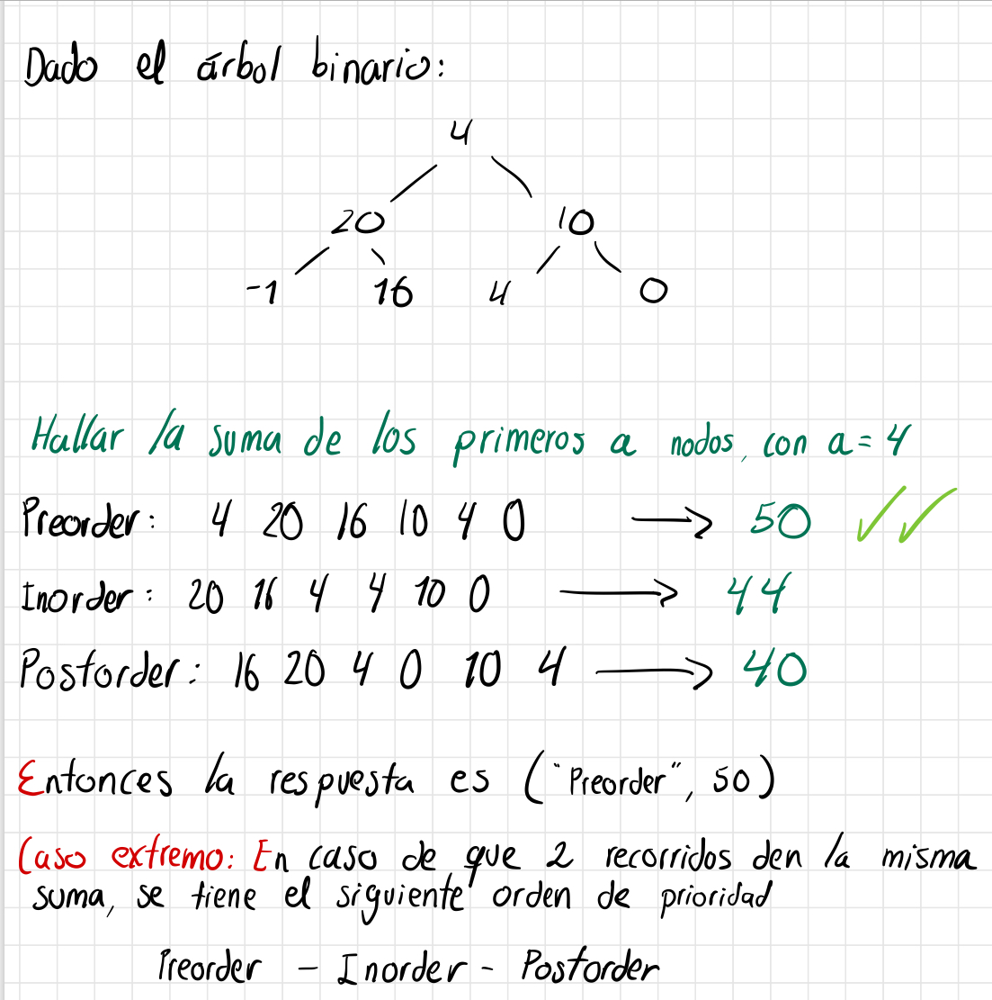

# Galapagos Islands

## Task

A group of botany students are interested in innovation. For that, 
they decide to take a trip to Wolf Island (which is one of the Galapagos 
Islands that can only be visited for those who have research purposes 
or want to do professional diving, not for tourists). This trip is 
naturally very expensive and you must make the most of it. They are 
going to investigate a new species of insect that lives in the treetops, 
but since the island is more than 1.5 square kilometers, they must maximize 
the sampling process. The sampling process is organized in n zones distributed 
across the islands, where each zone has an expected number of insects to collect i.

The idea then is to receive the list of the n numbers of insects expected per 
zone and add them in [level order](https://www.geeksforgeeks.org/create-a-tree-in-level-order/). 
In the construction of this tree you will find values in the range [-1, 25]. 
The value -1 is used to represent NULL (that is, that this node does not exist 
and therefore the expedition cannot be done). The other values different from -1 are 
values that do refer to the expected number of insects.

The expedition starts at the Wolf Volcano crater, which is the first zone in the list 
above and represents the root of the binary tree created above. Since you don't have 
the resources to go through each of the insect nests, you can only go through nodes. 
Then one of the students proposes 3 ways to carry out the expedition: Inorder tour, preorder 
and postorder. The student proposes to visit the first nodes in each tour, but does not have 
a computer on the Island to perform the calculations.

Her mission then is to help the student find the best route that she can take (Inorder, 
preorder or postorder) and the expected number of insects that she will be able to collect 
on said route.

She also takes into account that if there are two routes that have the same number of expected 
insects, the following preference criterion will be taken into account: Preorder-Inorder-Postorder.

### For example:


## Constraints

- The input binary tree is a complete binary tree with levels between 3 and 12.
- The values of each node are between 0 and 25 with the restriction that -1 represents NULL.

## Input Format

In the first line is the ordered list of possible insects
by zone (the first element is the root of the tree). There
are enough elements for each entry to have a complete binary
tree at its last level. In the second line goes the number of
nodes that must be visited.

## Output Format

Initially, the output says the best route to take, with the 
first letter capitalized ("Preorder", "Inorder", "Postorder") 
Then, separated by a space, goes the maximum number of insects 
that can be collected in the expedition.

## Sample Input

### Sample Input 1
```java {.highlight .highlight-source-java .bg-black}
4 20 10 -1 16 4 0
4
```

## Sample Output

### Sample Output 1
```java {.highlight .highlight-source-java .bg-black}
Preorder 50
```