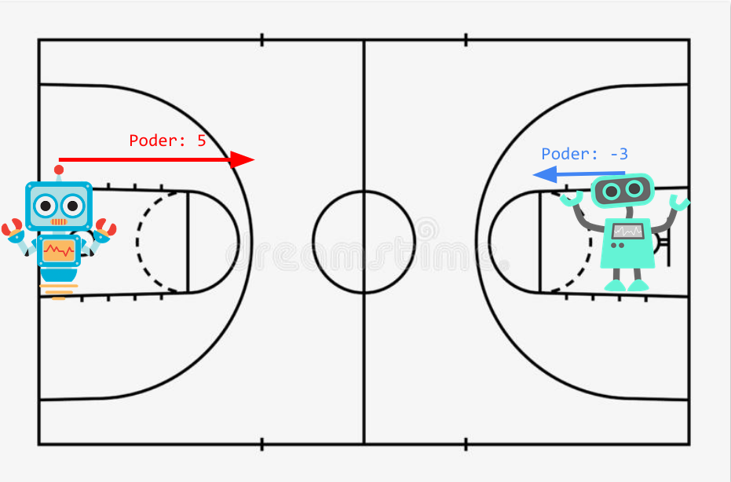

# Robots

## Task

Mechatronic engineering students had to do a project for a course, which consisted 
of building a sumo robot. They worked all semester on this and now it's time to put 
the robots to the test.

Each robot has a power that can be a number -10^4 <= n <= 10^4 and power != 0. 
The sign of the power indicates the direction the robot is moving: if it is positive, 
it moves to the right and if it is negative, it moves to the left.

Each robot moves at the same speed.

So, the course teacher decides to divide the class into two groups. Each group 
will be located at one end of the engineering courtyards basketball court. The 
robots that start from the left side of the field will have a positive power 
(they move to the right), and those that start from the right side will have a 
negative power (they move to the left), as seen in the following image: 


The game is simple: Every 5 seconds, each team will send a robot to crash with 
the robot of the opposing team. The moment they crash, the robot with the most 
power will destroy the weakest robot and continue on its way. If two robots have 
the same power, they both destroy each other.


The list of robot powers will have size n with 2<=n<=10^6. The task is to find 
and print the state of the sumo robots after all collisions.

## Constraints

- -10^4 <= power <= 10^4
- power != 0
- 2<=n<=10^6

## Input Format

This section is intended to describe the inputs of the problem, for example: 
it says that it has to read a number n such that 0 <= n <= 2000000000.

## Output Format

This section is intended to describe the format of the output or result 
of the problem. For example you can say: "Your program should print to the 
screen (using cout) a number n as indicated in the statement."

## Sample Input

### Sample Input 1
```java {.highlight .highlight-source-java .bg-black}
2 7 -3
```
### Sample Input 2
```java {.highlight .highlight-source-java .bg-black}
9 5 -10
```
### Sample Input 3
```java {.highlight .highlight-source-java .bg-black}
1 -1
```

## Sample Output

### Sample Output 1
```java {.highlight .highlight-source-java .bg-black}
2 7
```
### Sample Output 2
```java {.highlight .highlight-source-java .bg-black}
-10
```
### Sample Output 3
```java {.highlight .highlight-source-java .bg-black}
No quedaron robots!
```