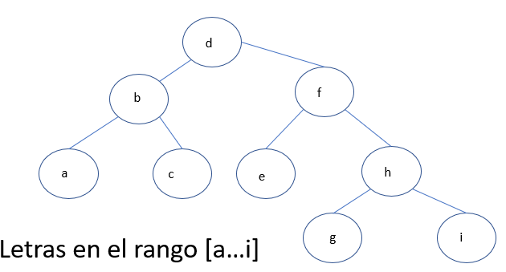

# Trips

## Task

Carlos, a systems engineering student, is thinking of traveling on vacation when the semester ends in July. 
For that, he asks his friend Mariana, who is a well-known tourist guide in the region, and she recommends 
that he travel through different towns in Boyacá. Carlos liked the idea and asked her to write on a list 
of different places that he should visit. Mariana wrote the following list:

{"Mongui", "Sachica", "Tinjaca", "Combita", "Chiquiza", "Sutamarchan", "Tibasosa", "Toca", "Guican", "Chivata", "Topaga", "Soraca", " Gameza", "Guayata", "Raquira", "Nobsa", "Tenza", "Aquitania"}

But Carlos, who is passionate about applying what he learns in Data Structures in his daily life, decides 
that he is going to add one by one and in order the places that Mariana wrote in the previous list in an AVL tree. 
Names are added in lexicographical order.

Once Carlos creates the AVL tree, he asks himself what will be the least number of places that he must visit 
between two places organized in the tree (the start and end places of the tour are taken into account).

### For example: 

In the above image, an AVL tree was created with the letters in the range [a..i]. To go from node 'c' to node 'e' 
you must follow the route c->b->d->f->e giving a total of 5 nodes.

## Constraints

- the least number of places to visit between two places arranged in the tree taking into account the 
start and end places of the tour.

## Input Format

Two different starting and ending points, separated by spaces.

## Output Format

Minimum number of places that you must visit in the tour of the 
AVL tree (Remember that the departure and arrival points are 
counted in this account).

## Sample Input

### Sample Input 1
```java {.highlight .highlight-source-java .bg-black}
Tinjaca Guican
```
### Sample Input 2
```java {.highlight .highlight-source-java .bg-black}
Tenza Chivata
```

## Sample Output

### Sample Output 1
```java {.highlight .highlight-source-java .bg-black}
6
```
### Sample Output 2
```java {.highlight .highlight-source-java .bg-black}
7
```