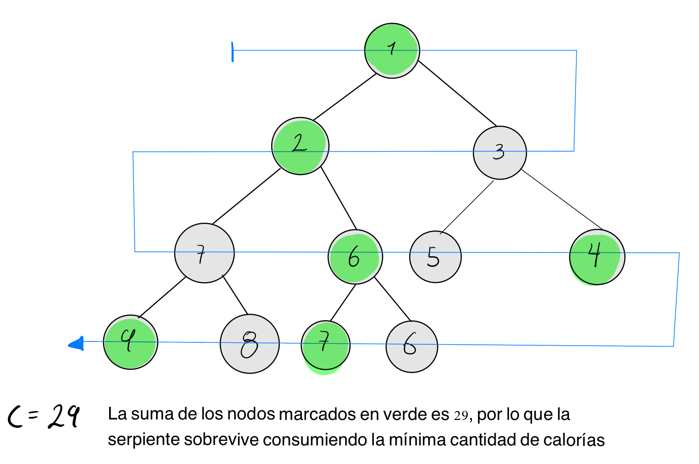

# The Snake

## Task

The corn snake (Pantherophis guttatus) inhabits North America and
is known for being able to travel long distances. For this they need
to consume a minimum amount of calories daily c. The snake can consume
all the calories it finds without problem, but if it does not consume
the minimum quantity it dies. The snake is going to go through different
places and your mission is to identify if the snake survives or not.

The route of the snake is carried out in the following way. First,
you receive the array representation of a binary tree. The snake 
traverses this binary tree in a zig-zag fashion starting at the root. 
The snake consumes the number of calories from the root of the tree, 
then skips one node and again consumes the number of calories from the 
next node to the skipped one, until it reaches the end of the path. The 
idea then is to identify if the number of calories that the snake managed
to consume on that journey allows it to survive. All this is illustrated
in the following image:



In the previous image, the example tree is assembled, whose representation
in the form of an array is [1, 2, 3, 7, 6, 5, 4, 9, 8, 7, 6]. The snake's
path then zig-zags to the right of the root. This route is shown with the
blue line. The nodes where the snake consumes calories are marked in green.
For this case, the snake had to consume at least 29 calories, which coincides
with the sum of the nodes where it consumed calories, so the snake survives.

## Constraints

- 10^1 <= minimum value <= 10^5
- 20 <= node number <= 10^4
- 2 <= node value <= 49

## Input Format

The first line receives the array representation of a binary tree with its
nodes separated by spaces. On the second line is the minimum number of 
calories the snake must consume.

## Output Format

If the snake survives, it should print "Survive". If the snake does not 
survive, it should print "Die".

## Sample Input

### Sample Input 1
```java {.highlight .highlight-source-java .bg-black}
1 2 3 7 6 5 4 9 8 7 6
29
```

## Sample Output

### Sample Output 1
```java {.highlight .highlight-source-java .bg-black}
Sobrevive
```